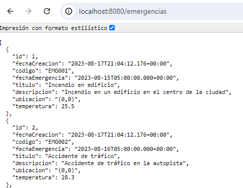
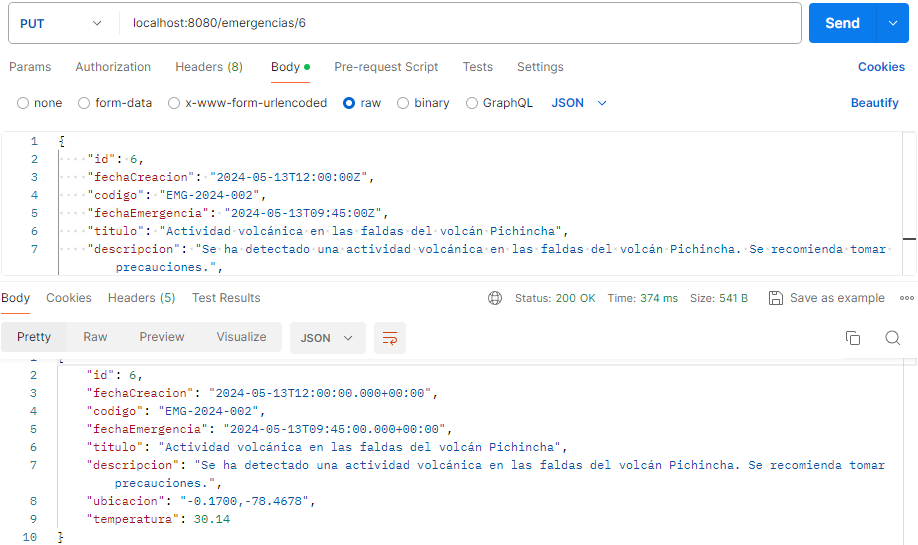

**Sistema de Registro de Emergencias**

**Objetivo**: El objetivo de este proyecto es desarrollar un sistema de registro de emergencias para los bomberos. El sistema permite a los usuarios registrar emergencias, incluyendo información como la fecha, el tipo de emergencia, la ubicación y la temperatura en el lugar del incidente. Además, los bomberos pueden ser asignados a emergencias específicas para su atención.

**Tecnologías Utilizadas**
- Java 17
- Spring Boot 3.1.2
- Spring Data JPA
- Spring Web
- PostgreSQL
- Maven

**Estructura de la Base de Datos**

El esquema de la base de datos utilizado en el proyecto consta de las siguientes tablas:

**emergencia:** Almacena la información de las emergencias registradas, incluyendo su fecha de creación, código, fecha de la emergencia, título, descripción, ubicación y temperatura.

- **Columnas:** id, fecha_creacion, codigo, fecha_emergencia, titulo, descripcion, ubicacion, temperatura.

**personal:** Contiene los detalles del personal involucrado en las emergencias, como su cédula, nombres, apellidos y tipo (por ejemplo, bombero, paramédico).

- **Columnas:** cedula, nombres, apellidos, tipo.

**emergencia_personal:** Esta tabla establece la relación entre las emergencias y el personal asignado a cada una.

- **Columnas:** emergencia_id, personal_cedula.
Desarrollo del Proyecto
El proyecto está desarrollado en Java utilizando el framework Spring Boot. Se utilizan varias dependencias de Spring Boot, incluyendo Spring Data JPA y Spring Web, para facilitar el desarrollo de la capa de persistencia y la exposición de servicios web RESTful.

La aplicación sigue una arquitectura basada en controladores (Controllers), servicios (Services) y repositorios (Repositories). Los controladores manejan las solicitudes HTTP, los servicios contienen la lógica de negocio y los repositorios gestionan la interacción con la base de datos.

Además, se utiliza PostgreSQL como base de datos relacional para almacenar la información de las emergencias y el personal. Maven se utiliza como sistema de gestión de proyectos para la construcción y gestión de dependencias del proyecto.

Este sistema proporciona una interfaz intuitiva y eficiente para registrar y gestionar emergencias, lo que permite una respuesta más rápida y coordinada ante situaciones críticas.

**Instrucciones de Ejecución**

- Clonar el repositorio del proyecto desde GitHub.
- Configurar la base de datos PostgreSQL y actualizar la configuración en el archivo application.properties.
- Compilar y ejecutar la aplicación utilizando Maven: mvn spring-boot:run.
- Acceder a la aplicación a través de la URL especificada en la configuración de Spring Boot.

Con esta aplicación, se propone una solución  para que los bomberos pueden registrar, actualizar y gestionar emergencias de manera eficiente, lo que contribuye a una respuesta más efectiva en situaciones de emergencia.

